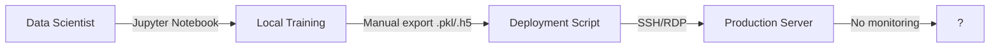

# Business Case: Level 1 → Level 2 AI SDLC Maturity

## Moving from Manual Delivery to Basic CI/CD

---

## Executive Summary

This organization currently operates at **Level 1** of the AI SDLC maturity model — models are developed in isolation, deployed by hand, and monitored (if at all) by user complaints. This document makes the case for investing in **Level 2** infrastructure: version control, basic CI/CD pipelines, and a model registry.

**The ask:** ~6-8 weeks of engineering effort to set up foundational tooling and processes. **The return:** faster model delivery (weeks → days), fewer production incidents, audit-readiness, and reduced bus-factor risk. The investment is primarily engineering time, not licensing costs — nearly all recommended tooling is open source.

---

## 1. Current State Assessment (Level 1)

### How AI Delivery Works Today

| Aspect | Current State |
|--------|---------------|
| **Code management** | Notebooks shared via email / shared drive |
| **Training** | Runs on local machines or ad-hoc VM |
| **Model storage** | `.pkl` / `.h5` files in random folders |
| **Deployment** | Manual copy to server, restart service |
| **Testing** | None or ad-hoc |
| **Monitoring** | None — issues found by users |
| **Rollback** | Keep old `.pkl` file if you remember where it is |

### Effort Distribution

Data Scientists currently spend an estimated **60-70% of their time** on:
- Manually reproducing experiments to track what changed
- Debugging deployment issues (wrong file, wrong path, missing dependency)
- Firefighting production incidents with no logs or metrics
- Rebuilding lost work when notebooks or files are misplaced

Only **30-40%** is spent on actual modeling, experimentation, and value creation.

### Model Inventory

| Model | Purpose | Deployed How | Last Updated |
|-------|---------|-------------|-------------|
| Model A | Classification | Manual `.pkl` copy | Unknown |
| Model B | Recommendation | Notebook export → SCP | 3 months ago |
| Model C | Fraud detection | Docker image (hand-built) | 6 weeks ago |

*Every model has a different delivery process and no standardized artifact.*

---

## 2. Pain Points & Risks

### For the C-Suite / Executives

| Risk | Business Impact |
|------|----------------|
| **No reproducibility** | Regulatory inquiries cannot be answered. "What data was Model A trained on?" — we cannot produce the answer. |
| **No audit trail** | Compliance audits (SOC 2, ISO 27001, internal) require evidence of controlled change management. We have none. |
| **Silent model degradation** | Model B's accuracy dropped 15% two months ago. We discovered it last week via a customer complaint. Revenue impact: ~$X/month. |
| **Bus-factor = 1** | The person who built Model C is the only one who understands it. If they leave, the model is unmaintainable. |
| **No velocity** | Each model update takes 2-3 weeks of re-learning and manual steps. Competitors deploying weekly. |

### For Engineering Leadership

| Pain Point | Detail |
|------------|--------|
| **Deployments are high-risk events** | Every deployment requires 2-3 hours of supervised cutover. No rollback plan. |
| **Onboarding takes months** | New Data Scientists cannot ship independently for 3-6 months due to tribal knowledge. |
| **No quality bar** | Models ship without automated tests or evaluation. Regressions discovered in production. |
| **Debugging is impossible** | Production issues have no logs, no metrics, no traceability. Root cause analysis is guessing. |
| **Resource waste** | 60-70% of Data Scientist time is spent on manual infrastructure, not modeling. |

---

## 3. Cost-Benefit Analysis

### Current Cost of Level 1

| Category | Annual Estimate |
|----------|----------------|
| Data Scientist time wasted on manual ops (3 DS × $180k × 65%) | ~$351,000 |
| Production incidents (avg 6/yr × 20hr remediation × $150/hr) | ~$18,000 |
| Delayed model releases (2-week delay × 4 releases × opportunity cost) | ~$50,000 |
| Onboarding cost (3 months × $180k per new hire × 2 hires) | ~$90,000 |
| **Total annual waste** | **~$509,000** |

### Investment Required (Level 2)

| Item | Cost | Notes |
|------|------|-------|
| Version control (GitHub/GitLab) | Already owned | Standard enterprise license |
| CI/CD minutes | ~$500/yr | GitHub Actions / GitLab CI |
| Model registry (MLflow) | Free | Open source, self-hosted |
| Container registry | ~$0-1,000/yr | Docker Hub / cloud registry |
| Engineering setup effort | 6-8 weeks of 1 ML Engineer | ~$40,000 one-time |
| Team training | 2-day workshop | ~$5,000 |
| **Total first year** | **~$46,500** | |

### Projected Returns

| Benefit | Year 1 Savings |
|---------|----------------|
| Data Scientist time recovered (65% → 35% overhead) | ~$162,000 |
| Incident reduction (6 → 2 per year) | ~$12,000 |
| Faster model delivery (weeks → days) | ~$100,000 |
| Faster onboarding (3 months → 3 weeks) | ~$60,000 |
| **Total Year 1 return** | **~$334,000** |
| **ROI (Year 1)** | **~7x** |

---

## 4. Proposed Roadmap

### Phase 1: Foundation (Weeks 1-2)

- Migrate all model code from notebooks to Python scripts in Git
- Establish branch strategy (main / develop / feature)
- Set up `.gitignore`, `requirements.txt`, `pyproject.toml`
- Implement code review process (PRs required for all model changes)

**Deliverable:** Every model has a Git repository with versioned code.

### Phase 2: CI Pipeline (Weeks 3-4)

- Add CI pipeline: lint (ruff/black), type-check (mypy), unit tests (pytest)
- Add data validation step: schema checks, missing value detection
- Set up automated model training trigger on merge to develop branch

**Deliverable:** Code changes automatically trigger tests and validation before merge.

### Phase 3: Model Registry (Weeks 5-6)

- Deploy MLflow (or alternative) for model artifact storage
- Instrument training scripts to log: hyperparameters, metrics, artifact location
- Register first model version through the registry

**Deliverable:** Every trained model is versioned, tagged, and traceable to code + data.

### Phase 4: CD Pipeline (Weeks 7-8)

- Containerize models (Dockerfile per model)
- Add deployment pipeline: build image → push to registry → deploy to staging
- Add manual approval gate before production promotion
- Create rollback script: deploy previous registry version

**Deliverable:** Staging deployments are automated; production requires one-click approval.

### Target Architecture (Level 2)

---

## 5. Success Metrics

| Metric | Current | Target (3 months) | Target (6 months) |
|--------|---------|-------------------|-------------------|
| Deployments via CI/CD | 0% | 100% | 100% |
| Time from commit to staging | N/A | < 1 hour | < 30 minutes |
| Model reproducibility rate | ~10% | 100% | 100% |
| Production incidents / quarter | 3-4 | ≤ 1 | ≤ 1 |
| Incident MTTR | 6-20 hours | < 2 hours | < 1 hour |
| Data Scientist time on modeling | ~35% | ~60% | ~65% |
| Onboarding to first deploy | 3-6 months | 3 weeks | 2 weeks |

---

## 6. Risk Mitigation

| Risk | Likelihood | Mitigation |
|------|-----------|------------|
| **Team resistance** to new process | Medium | Involve DS team in tool selection; start with one model as pilot; celebrate quick wins |
| **Tool sprawl** — too many tools, no integration | Low | Limit scope: Git + CI (GitHub Actions) + MLflow + Docker. No new tools until these work. |
| **Pipeline fragility** — broken CI blocks everyone | Medium | Start with optional gates on non-critical models; harden over time |
| **Loss of velocity during transition** | High | Keep old manual process available for critical releases during first 4 weeks; sunset gradually |
| **Underestimating effort** | Medium | Add 2-week buffer to roadmap; treat Phase 1-2 as minimal; defer Phase 3-4 if needed |

---

## 7. Appendix — Tooling Recommendations

| Function | Recommended Tool | Alternative |
|----------|-----------------|-------------|
| Version control | GitHub / GitLab | Azure DevOps |
| CI/CD | GitHub Actions | GitLab CI, Jenkins |
| Model registry | MLflow | DVC, Weights & Biases |
| Containerization | Docker | — |
| Container registry | Docker Hub / GHCR | ACR, ECR |
| Artifact storage | S3 / Azure Blob | MinIO (self-hosted) |
| Secret management | GitHub Secrets | HashiCorp Vault |

---

## 8. Next Steps

1. **Approve** the 8-week engineering allocation for this initiative
2. **Identify** one pilot model to migrate first
3. **Assemble** working group: 1 ML Engineer + 1 Data Scientist + 1 DevOps
4. **Schedule** 2-day kickoff workshop (training + roadmap refinement)
5. **Begin** Phase 1 implementation

---

*Prepared for engineering leadership and executive review.*
*AI SDLC Maturity Level 1 → Level 2 business case.*
