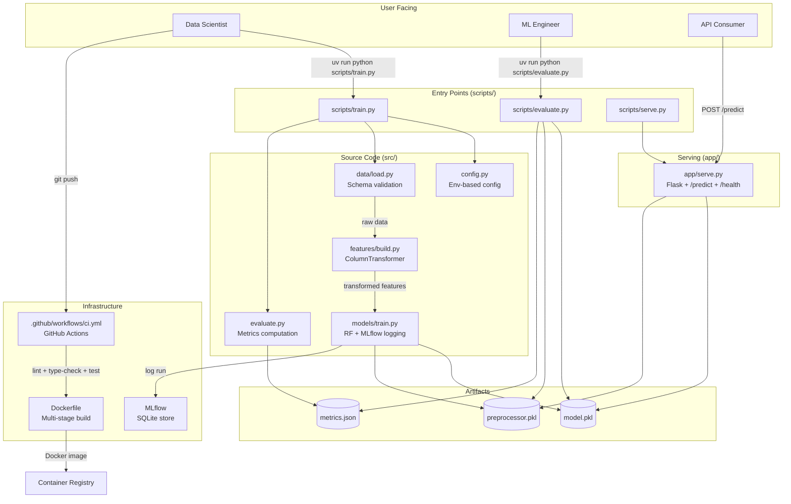
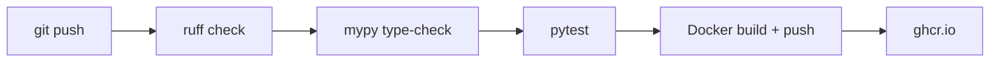
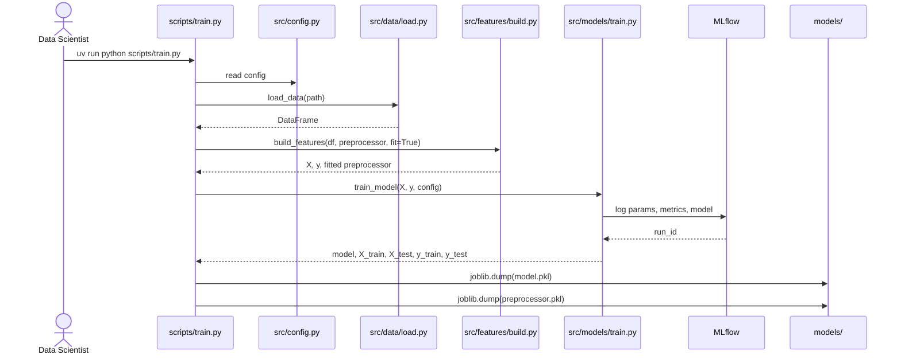
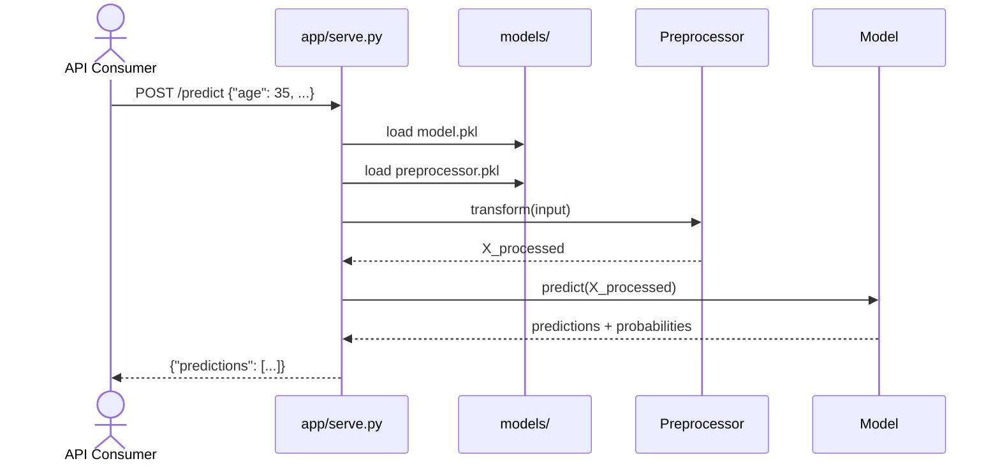

# Architecture — Level 2: Basic CI/CD

## Customer Churn Prediction

---

## 1. Overview

This project implements a **customer churn prediction** system at **Level 2** of the AI SDLC maturity model. The architecture shifts from a monolithic notebook (Level 1) to a modular, testable, and CI/CD-enabled codebase. The key architectural improvement is the separation of concerns into distinct layers — configuration, data, features, models, evaluation, serving, and infrastructure — each with a single responsibility.

---

## 2. Architectural Diagram



---

## 3. Layer Architecture

### 3.1 Configuration Layer (`src/config.py`)

The config layer eliminates all hardcoded paths and parameters. It uses a `@dataclass` with environment variable overrides and sensible defaults. Every component receives its configuration through this central object.

```python
@dataclass
class Config:
    data_path: str        # Default: data/customer_data.csv
    model_dir: str        # Default: models/
    random_seed: int      # Default: 42
    n_estimators: int     # Default: 100
    max_depth: int        # Default: 10
    test_size: float      # Default: 0.2
    port: int             # Default: 8080
    mlflow_uri: str       # Default: sqlite:///mlflow_data/mlflow.db
```

**Key design decisions:**
- All defaults resolve to paths within the project directory using `Path(__file__).resolve().parent.parent` — the project is relocatable
- MLflow tracking URI uses SQLite (not filesystem store, which is deprecated)
- A `ensure_dirs()` method creates all required directories at startup

### 3.2 Data Layer (`src/data/load.py`)

Handles loading and schema validation. Unlike Level 1 (which assumed the CSV was always correct), this layer:

- Defines `REQUIRED_COLUMNS` — a whitelist of 12 expected column names
- Provides `validate_schema()` — returns a list of missing columns
- `load_data()` raises `ValueError` if schema is invalid

**Why this matters:** Schema drift is one of the most common silent failure modes in production ML. This validation catches renamed or missing columns at load time rather than propagating silently to the model.

### 3.3 Feature Engineering Layer (`src/features/build.py`)

Replaces the manual `map()` calls in the Level 1 notebook with a proper `sklearn` `ColumnTransformer` pipeline.

**Components:**

| Component | Type | Columns |
|---|---|---|
| Numeric pipeline | `StandardScaler` | `age`, `tenure_months`, `monthly_charges`, `total_charges`, `avg_monthly_usage_hours`, `late_payments_last_12m` |
| Categorical pipeline | `OrdinalEncoder` | `contract_type`, `payment_method`, `internet_service`, `tech_support` |

**Key design decisions:**
- `OrdinalEncoder` uses `handle_unknown="use_encoded_value"` with `unknown_value=-1` — unseen categories in production don't crash the pipeline
- Category orderings are explicitly defined in `CAT_ORDERINGS` — this ensures reprojectibility across environments
- The pipeline is `fit_transform` during training and `transform` during evaluation/serving, maintaining a clean separation between fitted and inference states

### 3.4 Model Training Layer (`src/models/train.py`)

Encapsulates model training with MLflow integration.

**Training flow:**
1. Train/test split using config seed (deterministic)
2. `RandomForestClassifier` instantiated with config parameters
3. MLflow run started, logging:
   - Parameters: `n_estimators`, `max_depth`, `random_seed`, `test_size`, `model_type`
   - Metrics: `train_accuracy`, `test_accuracy`
   - Artifact: serialized model (with environment reproduction)
4. Returns trained model and data splits

**Why this matters:** Every training run is now traceable. Given a run ID, you can reconstruct the exact parameters, metrics, and code version that produced a model. This is the foundation of auditability.

### 3.5 Evaluation Layer (`src/evaluate.py`)

Computes a standardized set of classification metrics and writes them as JSON. Unlike Level 1 (metrics displayed in a notebook cell and lost on close), Level 2 persists metrics to disk:

```json
{
  "accuracy": 1.0,
  "precision": 1.0,
  "recall": 1.0,
  "f1_score": 1.0,
  "roc_auc": 1.0,
  "n_samples": 50,
  "confusion_matrix": [[30, 0], [0, 20]]
}
```

### 3.6 Serving Layer (`app/serve.py`)

A Flask application with two endpoints:

| Endpoint | Method | Purpose |
|---|---|---|
| `/health` | GET | Liveness probe — returns `{"status": "ok"}` |
| `/predict` | POST | Single or batch inference — accepts JSON object or array |

**Improvements over Level 1 serving:**
- Config-driven model path (env var `MODEL_PATH`)
- Health endpoint for orchestration platforms (Kubernetes readiness probes)
- Uses the same preprocessor pipeline as training (ensures consistency)
- Supports both single and batch inputs

---

## 4. CI/CD Pipeline

### 4.1 GitHub Actions Workflow (`.github/workflows/ci.yml`)



**Jobs:**

| Job | Trigger | Steps |
|---|---|---|
| `lint-test` | All pushes and PRs | `ruff check` → `mypy` → `pytest` |
| `build` | Push to `main` only | Docker build → push to `ghcr.io` |

**Design decisions:**
- Lint and test run on every PR — catches issues before merge
- Docker build only on `main` — keeps image production-ready
- Image tagged `latest` — simple rollback by redeploying previous `latest`
- Uses GitHub Container Registry — no additional registry credentials needed (uses `GITHUB_TOKEN`)

### 4.2 Dockerfile

Multi-stage build to minimize final image size:

| Stage | Base | Purpose |
|---|---|---|
| `builder` | `python:3.12-slim` | Install dependencies with UV, compile packages |
| `runner` | `python:3.12-slim` | Copy only site-packages and application code; no build tools |

Final image size is kept minimal by excluding UV, pip, and build dependencies from the runtime stage.

---

## 5. Data Flow

### 5.1 Training Flow



### 5.2 Prediction Flow



---

## 6. Key Improvements Over Level 1

### Structural Improvements

| Aspect | Level 1 | Level 2 | Benefit |
|---|---|---|---|
| **Code organization** | Monolithic notebook | Modular package (`src/`) | Reusable, testable, importable |
| **Configuration** | Hardcoded strings | Env-var-based `Config` dataclass | Relocatable, env-specific values |
| **Preprocessing** | Ad-hoc `map()` calls | `ColumnTransformer` pipeline | Consistent train/serve, handles unknowns |
| **Training logic** | In notebook cells | `scripts/train.py` entry point | Repeatable, scriptable, CI-integratable |
| **Tests** | None | pytest (7 tests) | Catches regressions before deploy |
| **CI** | None | GitHub Actions (ruff → mypy → pytest → build) | Automated quality gates |
| **Deployment** | Manual SCP/SSH | Docker image + registry | Immutable, versioned, audit-ready |
| **Model tracking** | `.pkl` filenames | MLflow (params, metrics, artifacts) | Full experiment traceability |

### Code Quality Improvements

- **Type hints** throughout — catch type errors at lint time
- **No global state** — all dependencies passed explicitly
- **Separation of concerns** — data, features, models, evaluation in separate modules
- **Error handling** — schema validation, encoding guardrails, HTTP-level error responses

### Reproducibility Improvements

- Locked Python version (`.python-version`)
- Locked dependency tree (`uv.lock`)
- Locked random seed (config)
- MLflow captures parameters, metrics, and environment per run
- Config is externalized — no code changes needed for different environments

---

## 7. Limitations (Level 2 Characteristics)

These limitations are intentional and define the boundary between Level 2 and Level 3+:

| Limitation | Why It Exists | Addressed In |
|---|---|---|
| Data pipeline is manual | No automated data validation pipeline | Level 3 |
| No automated evaluation gate | Evaluation is a CLI script, not a CI gate | Level 3 |
| No monitoring | No production telemetry or drift detection | Level 3 |
| Manual promotion to prod | Docker image is built but not auto-deployed | Level 3 |
| No automated retraining | Retraining requires manual trigger | Level 5 |
