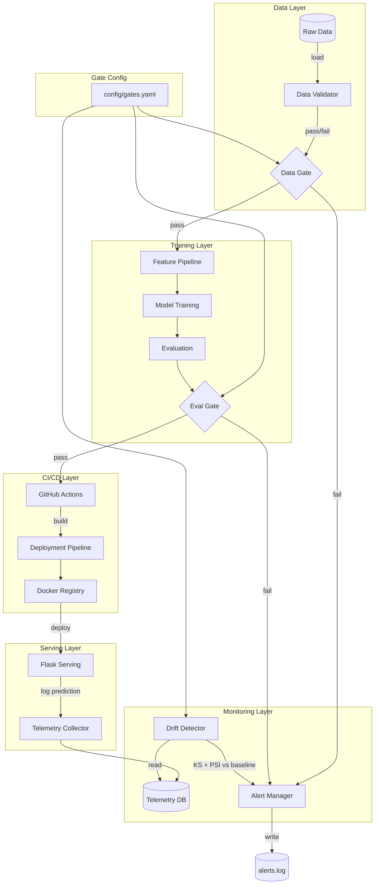
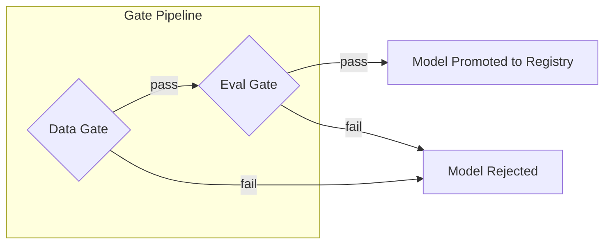
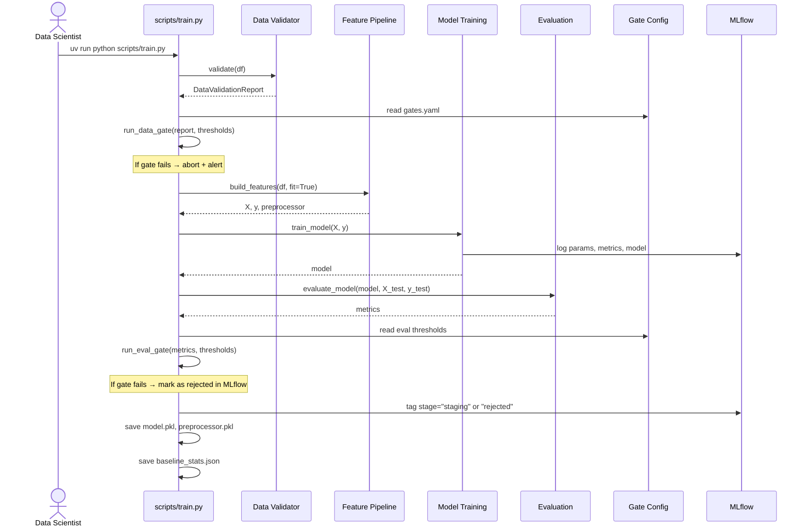
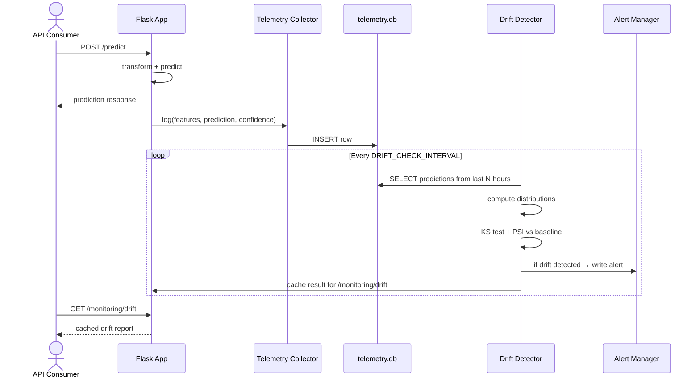

# Architecture — Level 3: Automated Gates

## Customer Churn Prediction

---

## 1. Overview

This project implements a **customer churn prediction** system at **Level 3** of the AI SDLC maturity model. The architecture extends Level 2 by introducing **automated quality gates** at every stage of the ML lifecycle — data ingestion, model training, CI/CD promotion, and production monitoring.

Three new subsystems are added:

1. **Data Validation Pipeline** — statistical profiling and anomaly detection before training
2. **Quality Gate Framework** — configurable pass/fail thresholds enforced at each stage
3. **Monitoring & Drift Detection** — prediction telemetry collection and distribution comparison

---

## 2. Architectural Diagram



---

## 3. New Subsystems

### 3.1 Data Validation Pipeline (`src/data/validate.py`)

Replaces Level 2's simple schema check with a full statistical validation.

#### Validation Checks

| Check | Method | Threshold (from `gates.yaml`) |
|---|---|---|
| **Row count** | `len(df) >= min_rows` | `min_rows: 10` |
| **Missing values** | `df.isnull().sum() / len(df) <= max_null_fraction` per column | `max_null_fraction: 0.05` |
| **Numeric range** | Flag values outside `mean ± 4 * std` | `max_anomaly_rate: 0.10` |
| **Categorical coverage** | Unseen categories trigger warning | `max_novel_category_rate: 0.20` |
| **Column presence** | All `REQUIRED_COLUMNS` present | Always enforced |

#### Output: `DataValidationReport`

```python
@dataclass
class DataValidationReport:
    passed: bool
    n_rows: int
    n_columns: int
    null_fractions: dict[str, float]
    anomaly_rates: dict[str, float]
    novel_categories: dict[str, list[str]]
    warnings: list[str]
    errors: list[str]
```

#### Integration

- Called at the start of `scripts/train.py` — fails fast before any computation
- Available as standalone CLI: `python scripts/validate_data.py --data path.csv`
- Produces a JSON report saved alongside model artifacts for audit trail

---

### 3.2 Quality Gate Framework (`src/gates.py` + `config/gates.yaml`)

A composable, configuration-driven gate system.

#### Gate Configuration (`config/gates.yaml`)

```yaml
gates:
  data_validation:
    min_rows: 10
    max_null_fraction: 0.05
    max_anomaly_rate: 0.10
    max_novel_category_rate: 0.20

  evaluation:
    min_accuracy: 0.75
    min_precision: 0.70
    min_recall: 0.65
    min_f1: 0.70
    min_roc_auc: 0.75

  drift:
    max_feature_drift_pvalue: 0.05
    max_psi: 0.20
    min_psi_samples: 30
```

#### Gate Architecture

Each gate is a function that implements the `Gate` protocol:

```python
class GateResult:
    passed: bool
    gate_name: str
    checks: dict[str, bool | float]
    summary: str

Gate = Callable[..., GateResult]
```

| Gate | Input | Function |
|---|---|---|
| `DataGate` | `DataValidationReport` | Validates against data thresholds |
| `EvalGate` | Metrics dict + thresholds | Compares metrics to minimums |
| `DriftGate` | Baseline stats + live stats | KS p-value and PSI checks |

#### Gate Registry

Gates are registered in `src/gates.py` and can be composed:

```python
def run_all_gates(
    config: dict,
    data_report: DataValidationReport | None = None,
    metrics: dict | None = None,
    drift_report: dict | None = None,
) -> list[GateResult]:
    results = []
    if data_report:
        results.append(run_data_gate(config["data_validation"], data_report))
    if metrics:
        results.append(run_eval_gate(config["evaluation"], metrics))
    if drift_report:
        results.append(run_drift_gate(config["drift"], drift_report))
    return results
```

#### Promotion Flow



Only models that pass all gates are registered in MLflow with the `stage = "staging"` tag. Failed models are logged but marked `stage = "rejected"` with gate results attached as MLflow tags.

---

### 3.3 Monitoring & Drift Detection (`src/monitoring/`)

Three components that together provide production observability.

#### 3.3.1 Telemetry Collector (`src/monitoring/collector.py`)

Runs in the Flask serving process. Logs every prediction request to a SQLite database.

**Schema (`monitoring/telemetry.db`):**

```sql
CREATE TABLE predictions (
    id INTEGER PRIMARY KEY AUTOINCREMENT,
    timestamp TEXT NOT NULL,
    age REAL, tenure_months REAL, monthly_charges REAL,
    total_charges REAL, avg_monthly_usage_hours REAL,
    late_payments_last_12m REAL,
    contract_type TEXT, payment_method TEXT,
    internet_service TEXT, tech_support TEXT,
    prediction INTEGER,
    confidence_churn REAL,
    confidence_stay REAL
);
```

**Design decisions:**
- SQLite chosen for zero-infrastructure, file-based, queryable storage
- Each prediction is a row — enables time-series analysis
- The collector runs synchronously in the request thread (low overhead — single INSERT)
- Configurable retention: records older than `MONITORING_RETENTION_DAYS` (default 90) are pruned

#### 3.3.2 Drift Detector (`src/monitoring/drift.py`)

Compares live prediction distributions against a saved baseline.

**Baseline generation:** During training, `scripts/train.py` computes per-feature statistics on the training set and saves them to `monitoring/reference/baseline_stats.json`:

```json
{
  "numeric": {
    "age": {"mean": 40.5, "std": 12.3, "p50": 41.0, "p95": 60.0},
    "tenure_months": {"mean": 24.0, "std": 17.0, ...},
    ...
  },
  "categorical": {
    "contract_type": {"Month-to-month": 0.5, "One year": 0.3, "Two year": 0.2},
    ...
  },
  "n_samples": 50
}
```

**Drift detection methods:**

| Feature Type | Method | Interpretation |
|---|---|---|
| Numeric | Two-sample KS test (`scipy.stats.ks_2samp`) | `p < 0.05` → distribution has shifted |
| Categorical | Population Stability Index (PSI) | `PSI > 0.20` → significant shift |

**PSI calculation:**

```
PSI = sum((p_i - q_i) * ln(p_i / q_i))
```
Where `p_i` = baseline proportion in bucket `i`, `q_i` = live proportion.

**Output:**

```python
@dataclass
class DriftReport:
    passed: bool
    feature_drifts: dict[str, dict]
    n_drifted_features: int
    overall_psi: float
    timestamp: str
```

#### 3.3.3 Alert Manager (`src/monitoring/alert.py`)

Writes structured alerts to `monitoring/alerts.log`.

**Alert levels:**

| Level | When |
|---|---|
| `INFO` | Model deployed, gate passed, routine event |
| `WARNING` | Drift p-value < 0.05 but > 0.01; anomaly rate elevated |
| `CRITICAL` | Gate failed; drift p-value < 0.01; PSI > 0.30 |

**Log format:**

```
[2026-06-21 14:30:00] CRITICAL [drift] Feature 'age' drifted (KS p=0.002, n_live=150, n_baseline=50)
[2026-06-21 14:30:00] WARNING  [drift] 3 of 10 features drifted. Overall PSI: 0.25
```

**Extensibility:** The `AlertSink` protocol allows adding new sinks (webhook, Slack, PagerDuty) without changing the alert logic:

```python
class AlertSink(Protocol):
    def send(self, level: str, source: str, message: str) -> None: ...

class FileSink:
    def __init__(self, path: str): ...
    def send(self, level, source, message): ...
```

---

## 4. Serving Layer Changes

The Flask app from Level 2 is extended with monitoring endpoints.

### New Endpoints

| Endpoint | Method | Purpose |
|---|---|---|
| `GET /monitoring/drift` | GET | Returns latest drift report (cached, recomputed every `DRIFT_CHECK_INTERVAL` seconds) |
| `GET /monitoring/summary` | GET | Returns prediction statistics: total predictions, churn rate, average confidence, time range |

### Modified Endpoint

`POST /predict` now logs each request to the telemetry database via the collector, in addition to returning the prediction.

### Background Thread

A background thread runs `check_drift()` every `DRIFT_CHECK_INTERVAL` (default 3600s = 1 hour):

1. Fetches predictions from the last `DRIFT_WINDOW_HOURS` (default 24)
2. Aggregates numeric distributions and categorical frequencies
3. Runs KS tests and PSI against baseline
4. Compares results against drift thresholds from `gates.yaml`
5. Writes alert if drift detected
6. Caches the result for the `/monitoring/drift` endpoint

---

## 5. CI/CD Changes

The GitHub Actions workflow from Level 2 is extended with an **evaluation gate job**.

### Workflow (`ci.yml`)

```yaml
jobs:
  lint-test:
    # ... same as Level 2 ...

  eval-gate:
    needs: lint-test
    runs-on: ubuntu-latest
    steps:
      - uses: actions/checkout@v4
      - name: Install & train
        run: |
          uv sync
          uv run python scripts/train.py
      - name: Run evaluation gates
        run: uv run python scripts/run_gates.py --config config/gates.yaml
      - name: Upload model artifacts
        uses: actions/upload-artifact@v4
        with:
          name: model
          path: models/

  build:
    needs: eval-gate
    if: github.ref == 'refs/heads/main'
    # ... same as Level 2 ...
```

**Key change:** The build job runs only if:
1. `lint-test` passes (code quality)
2. `eval-gate` passes (model quality)

This creates an **automated quality gate** — regressions in model performance block CI.

---

## 6. Data Flow

### 6.1 Training with Gates



### 6.2 Serving with Monitoring



---

## 7. Improvements Over Level 2

| Capability | Level 2 | Level 3 | Benefit |
|---|---|---|---|
| **Data validation** | Schema check on load | Statistical profile + anomaly detection + gate | Bad data caught before training starts |
| **Model evaluation** | Manual CLI, metrics in JSON | Configurable threshold gates in YAML | Regressions block CI automatically |
| **Production monitoring** | None | SQLite telemetry + KS test + PSI drift detection | Degradation detected in hours, not weeks |
| **Alerting** | None | File-based with severity levels (INFO/WARNING/CRITICAL) | Team knows when to act |
| **Promotion control** | Any model can be promoted | Only models passing all gates | Quality baseline enforced automatically |
| **Audit trail** | MLflow run ID only | MLflow + gate results + telemetry + alerts | Full provenance from data to production |
| **CI pipeline** | lint → test → build | lint → test → eval-gate → build | Model quality alongside code quality |

### Gate Comparison

| Stage | Level 2 | Level 3 |
|---|---|---|
| Data → Train | No check | `DataGate` — min rows, nulls, anomalies |
| Train → Registry | Always registered | `EvalGate` — metrics must exceed thresholds |
| Registry → Prod | Manual approval | `EvalGate` in CI — automated pass/fail |
| Prod → Monitor | Nothing | `DriftGate` — KS test + PSI on live data |

---

## 8. Project Structure

```
Level_3_Automated_Gates/
├── BUSINESS_CASE.md                  ← Business case (this document)
├── ARCHITECTURE.md                   ← Architecture document
├── README.md                         ← Operating instructions
├── pyproject.toml                    ← Dependencies + tool config
├── uv.lock / .python-version         ← Reproducible environment
├── .gitignore
├── config/
│   └── gates.yaml                    ← Gate threshold configuration
├── src/
│   ├── __init__.py
│   ├── config.py                     ← Config (env vars + monitoring settings)
│   ├── data/
│   │   ├── __init__.py
│   │   ├── load.py                   ← Data loading + schema validation (from L2)
│   │   └── validate.py               ← NEW: Statistical profiling + anomaly detection
│   ├── features/
│   │   ├── __init__.py
│   │   └── build.py                  ← ColumnTransformer pipeline (from L2)
│   ├── models/
│   │   ├── __init__.py
│   │   ├── train.py                  ← MLflow-logged training (from L2)
│   │   └── registry.py               ← NEW: Gate-conscious model registry
│   ├── evaluate.py                   ← Threshold-aware evaluation
│   ├── gates.py                      ← NEW: Quality gate definitions
│   └── monitoring/
│       ├── __init__.py
│       ├── collector.py              ← NEW: Prediction telemetry → SQLite
│       ├── drift.py                  ← NEW: KS test + PSI drift detection
│       └── alert.py                  ← NEW: File-based alerting
├── scripts/
│   ├── train.py                      ← Modified: includes data gate + baseline generation
│   ├── evaluate.py                   ← From L2
│   ├── serve.py                      ← From L2
│   ├── validate_data.py              ← NEW: Standalone data validation CLI
│   ├── run_gates.py                  ← NEW: Run quality gates on a model
│   └── check_drift.py               ← NEW: Drift check CLI
├── app/
│   └── serve.py                      ← Modified: prediction logging + monitoring endpoints
├── tests/
│   ├── __init__.py
│   ├── conftest.py                   ← From L2
│   ├── test_features.py              ← From L2
│   ├── test_evaluate.py              ← From L2
│   ├── test_data_validate.py         ← NEW
│   ├── test_gates.py                 ← NEW
│   └── test_monitoring.py            ← NEW
├── notebooks/
│   └── explore.ipynb                 ← From L2
├── monitoring/
│   ├── telemetry.db                  ← SQLite store (gitignored)
│   ├── alerts.log                    ← Alert output (gitignored)
│   └── reference/
│       └── baseline_stats.json       ← Baseline distributions (generated)
├── Dockerfile                        ← Modified
├── .github/workflows/
│   └── ci.yml                        ← Modified: eval gate step added
└── data/
    └── customer_data.csv             ← From L2
```

---

## 9. Dependencies

New Python dependencies added beyond Level 2:

| Package | Purpose |
|---|---|
| `scipy>=1.11.0` | `ks_2samp` for drift detection |

All other components use the standard library (`sqlite3`, `json`, `dataclasses`, `logging`).

---

## 10. Limitations (Level 3 Characteristics)

These are the **known limitations** of Level 3 — they will be addressed in Level 4+:

| Limitation | Why It Exists | Addressed In |
|---|---|---|
| Pipelines are hardcoded — switching model architectures requires code changes | Gate thresholds are configurable, but pipeline stages are not | Level 4 (Parameterized Pipelines) |
| Drift detection is reactive — alerts fire but no automatic correction | Human investigation still required before retraining | Level 5 (Closed-Loop) |
| Evaluation metrics are static — thresholds don't adapt to business conditions | All gates use fixed YAML thresholds | Level 4-5 |
| Pipeline failures cascade — data gate failure blocks training, which blocks CI | Sequential pipeline dependency | Level 4 (parallel stages) |
| Monitoring is file-based — no dashboard, no centralized observability | SQLite + file alerts are suitable for demo scale | Production deployment would use Prometheus/Grafana |
