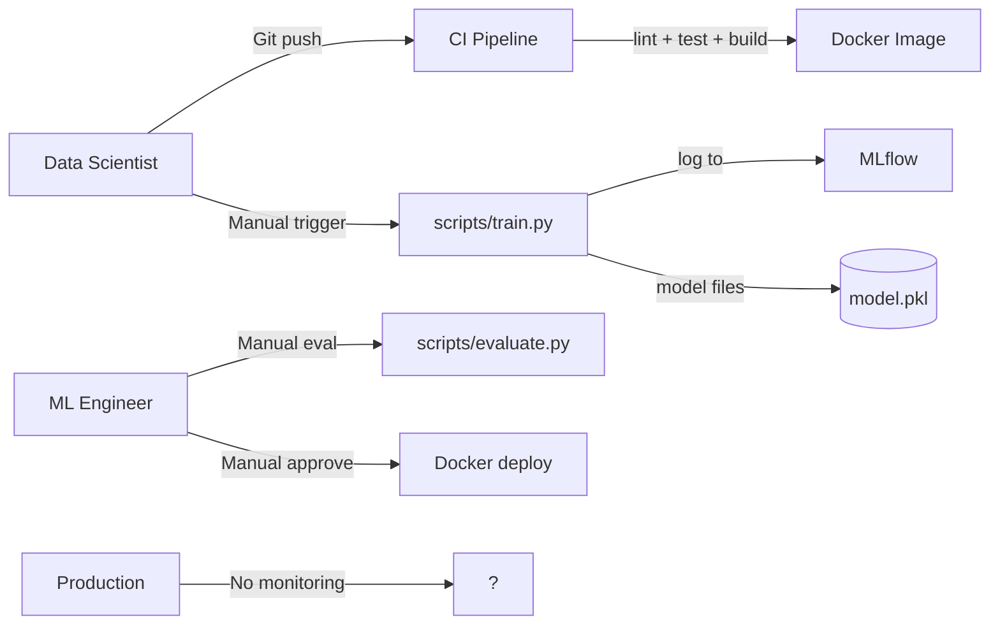

# Business Case: Level 2 → Level 3 AI SDLC Maturity

## Moving from Basic CI/CD to Automated Gates

---

## Executive Summary

This organization currently operates at **Level 2** of the AI SDLC maturity model — code is version-controlled, CI/CD pipelines run, models are tracked in MLflow, and deployment is containerized. However, **data quality, model evaluation, and production monitoring remain manual**. Regressions can still reach production undetected, model degradation goes unnoticed until users complain, and there is no automated safety net between a code push and a production deployment.

This document makes the case for investing in **Level 3** infrastructure: automated data validation, evaluation quality gates, and production monitoring with drift detection.

**The ask:** ~8-10 weeks of engineering effort to build and integrate data validation pipelines, configurable quality gates, and a monitoring framework. **The return:** incidents caught before they reach production, model degradation detected within hours instead of weeks, and an auditable quality trail for every model promotion. The investment is primarily engineering time — tooling costs are negligible (SQLite, scikit-learn, custom Python).

---

## 1. Current State Assessment (Level 2)

### How AI Delivery Works Today

| Aspect | Current State |
|--------|---------------|
| **Code quality** | Automated — ruff + mypy + pytest in CI |
| **Data quality** | Manual — schema check on load only |
| **Model evaluation** | Manual — run `scripts/evaluate.py`, look at metrics |
| **Quality gates** | None — any model that trains can be deployed |
| **Production monitoring** | None — model degradation discovered reactively |
| **Drift detection** | None — no baseline, no comparison |
| **Incident response** | Reactive — users report problems, team investigates |

### Team Effort Distribution

ML Engineers and Data Scientists currently spend an estimated **30-40% of their time** on:
- Manually validating data quality before each training run
- Copy-pasting evaluation metrics into spreadsheets for comparison
- Investigating production incidents with zero telemetry
- Manually comparing old vs. new model performance on ad-hoc test sets
- Responding to user-reported degradation (reproduce, diagnose, rollback)

Only **60-70%** is spent on actual modeling, experimentation, and value creation.

### Recent Incidents

| Incident | Impact | Detection Method | Recovery Time |
|----------|--------|-----------------|---------------|
| Schema drift — new contract type added upstream | Training crashed after 30 minutes | Manual — Data Scientist noticed failed job | 2 hours |
| Silent degradation — model accuracy dropped 8% | Incorrect churn flags for 2 weeks | Customer complaint | 3 days to detect, 1 day to fix |
| Feature distribution shift — usage hours doubled | All predictions skewed toward churn | Monthly manual audit | 1 week to detect |

**All three incidents would have been prevented by Level 3 gates.**

---

## 2. Pain Points & Risks

### For Engineering Leadership

| Risk | Business Impact | Cost of Waiting |
|------|----------------|-----------------|
| **No data quality gate** — bad data trains bad models | Wasted GPU hours, delayed releases, retraining cycles | ~$15K/incident in compute + engineering time |
| **No eval gate** — regressions deploy silently | Degraded model in production; manual rollback; customer trust erosion | ~$20K/incident + reputational damage |
| **No monitoring** — degradation goes undetected | Weeks of suboptimal predictions before detection; compounding business impact | ~$5K/week per degraded model |
| **No drift detection** — distribution shifts cause silent failure | Model becomes increasingly inaccurate over time; no trigger to retrain | Cumulative — grows with time since deployment |
| **No audit trail** — "why was this model promoted?" | Regulatory/compliance exposure; SOC 2 evidence gaps | Hard to quantify, but potentially severe |

### For the Data Science Team

| Pain Point | Detail |
|------------|--------|
| **"Is this data any good?"** | No automated answer. Every training run requires manual data inspection. |
| **"Is this model better than the last one?"** | No automated comparison. Metrics exist in isolation, not in context. |
| **"Is the model still working in production?"** | No dashboard, no alert, no answer until someone asks. |
| **"Why did this prediction change?"** | No telemetry, no baseline, no drift analysis — impossible to diagnose. |

---

## 3. Cost-Benefit Analysis

### Current Cost of Level 2 Gaps

| Category | Annual Estimate |
|----------|----------------|
| Data quality incidents (4/yr × $15K) | ~$60,000 |
| Eval/deployment regressions (3/yr × $20K) | ~$60,000 |
| Undetected degradation (2 models × 6 weeks/yr × $5K) | ~$60,000 |
| Manual investigation time (3 engineers × 15% × $180K) | ~$81,000 |
| **Total annual waste** | **~$261,000** |

### Investment Required (Level 3)

| Item | Cost | Notes |
|------|------|-------|
| Data validation pipeline (2 weeks) | ~$10,000 | 1 ML Engineer |
| Quality gate framework + config (2 weeks) | ~$10,000 | 1 ML Engineer |
| Monitoring + drift detection (3 weeks) | ~$15,000 | 1 ML Engineer |
| CI/CD integration + app changes (1 week) | ~$5,000 | 1 DevOps/MLOps |
| Testing + hardening (2 weeks) | ~$10,000 | 1 ML Engineer |
| **Total one-time investment** | **~$50,000** | 10 weeks engineering |

### Projected Returns

| Benefit | Year 1 Savings |
|---------|----------------|
| Data quality incidents prevented (4 → 0) | ~$60,000 |
| Deployment regressions caught by gates (3 → 0) | ~$60,000 |
| Degradation detected in hours, not weeks | ~$50,000 |
| Engineer time recovered (15% → 5% manual ops) | ~$54,000 |
| **Total Year 1 return** | **~$224,000** |
| **ROI (Year 1)** | **~4.5x** |

---

## 4. Proposed Roadmap

### Phase 1: Data Validation (Weeks 1-2)

- Build `src/data/validate.py`: statistical profiling, anomaly detection, validation report
- Add `config/gates.yaml` for threshold configuration
- Integrate validation into `scripts/train.py` — fail fast on bad data
- Add CLI: `python scripts/validate_data.py --data data.csv --config config/gates.yaml`

**Deliverable:** Every training run automatically validates data quality before training starts.

### Phase 2: Quality Gates (Weeks 3-4)

- Build `src/gates.py`: composable pass/fail evaluators (data, eval, drift gates)
- Build `src/models/registry.py`: gate-conscious promotion — only promote if all gates pass
- Add `scripts/run_gates.py`: run all gates against a model version
- Add `tests/test_gates.py`

**Deliverable:** Models are only promoted to the registry if all configured gates pass.

### Phase 3: Evaluation Gate in CI (Weeks 5-6)

- Modify `.github/workflows/ci.yml`: add evaluation gate step after pytest
- Gate reads `config/gates.yaml` thresholds, compares against model metrics
- CI fails if evaluation gate doesn't pass — regressions never merge

**Deliverable:** Pull requests that introduce model regressions are blocked by CI.

### Phase 4: Monitoring & Drift Detection (Weeks 7-9)

- Build `src/monitoring/collector.py`: log predictions to `monitoring/telemetry.db`
- Build `src/monitoring/drift.py`: KS test (numeric) + PSI (categorical) drift detection
- Build `src/monitoring/alert.py`: file-based alerts with severity levels
- Modify `app/serve.py`: log predictions, expose `/monitoring/drift` and `/monitoring/summary`
- Add `scripts/check_drift.py`: standalone drift check CLI
- Generate baseline stats as part of training pipeline

**Deliverable:** Every prediction is logged; drift is detected within minutes; alerts are written to file.

### Phase 5: Hardening & Docs (Week 10)

- End-to-end integration testing
- `tests/test_monitoring.py`, `tests/test_data_validate.py`
- `ARCHITECTURE.md`, updated `README.md`

**Deliverable:** Fully documented, tested Level 3 pipeline.

---

## 5. Target Architecture (Level 3)

```mermaid
graph LR
    Raw[Raw Data] -->|Ingestion| DataVal[Data Validation]
    DataVal -->|Schema + stats + anomaly| DataGate{Data Quality Gate}
    DataGate -->|Pass| FS[Feature Pipeline]
    DataGate -->|Fail| Alert1[Alert: Data Rejected]
    FS -->|Transformed features| Train[Training Pipeline]
    Train -->|Model + metrics| Eval[Evaluation Pipeline]
    Eval -->|Compare thresholds| EvalGate{Eval Gate}
    EvalGate -->|Pass| ModelReg[Model Registry]
    EvalGate -->|Fail| Alert2[Alert: Model Rejected]
    ModelReg -->|Promote| CD[CI/CD Pipeline]
    CD -->|Canary| Prod[Production]
    Prod -->|Telemetry| Monitor[Monitoring Pipeline]
    Monitor -->|KS + PSI| DriftGate{Drift Gate}
    DriftGate -->|Pass| OK[OK]
    DriftGate -->|Fail| Alert3[Alert: Drift Detected]
```

---

## 6. Success Metrics

| Metric | Current (L2) | Target (3 months) | Target (6 months) |
|--------|-------------|-------------------|-------------------|
| Data quality checks before training | None | 100% of runs | 100% of runs |
| Models evaluated against gates | 0% | 100% | 100% |
| CI failures due to eval gate | N/A | Gates active | Gates active |
| Prediction telemetry collected | None | 100% of requests | 100% of requests |
| Drift detection frequency | Never | Daily | Real-time |
| Time to detect degradation | 1-3 weeks | < 1 day | < 1 hour |
| Production incidents from regressions | 3/yr | 0/yr | 0/yr |

---

## 7. Risk Mitigation

| Risk | Likelihood | Mitigation |
|------|-----------|------------|
| **Gate thresholds too strict** — blocks valid models | Medium | Start with lenient thresholds; ratchet over time. All gate overrides logged. |
| **Drift detection false positives** — alert fatigue | Medium | Tune KS p-value and PSI thresholds on historical data first. Configurable per feature. |
| **Monitoring storage growth** — telemetry DB fills disk | Low | Configurable retention window; auto-prune records older than 90 days. |
| **Pipeline complexity** — too many stages slow down iteration | Medium | Gates are opt-out per model version. Stage gates can be bypassed with explicit override. |
| **Team doesn't trust gates** — bypass becomes habit | Medium | Involve DS team in threshold setting. Make gate results visible and explainable. |

---

## 8. Tooling & Dependencies

| Need | Tool | Justification |
|------|------|---------------|
| Data validation | Custom Python + scipy.stats | Lightweight, no external deps |
| Quality gates | Custom Python (YAML config) | Fully configurable, team-owned |
| Monitoring storage | SQLite | Zero infrastructure, file-based, sufficient for demo/medium scale |
| Drift detection | scipy.stats.ks_2samp (numeric) + custom PSI (categorical) | Standard statistical methods |
| Alerting | File-based (Python logging) | Simple, auditable, extendable to webhooks |

---

## 9. Next Steps

1. **Approve** the 10-week engineering allocation
2. **Identify** current model versions and capture baseline distributions
3. **Pilot** Phase 1-2 on the churn prediction model
4. **Tune** gate thresholds on historical data (2 weeks of parallel runs)
5. **Roll out** to all models after pilot validation

---

*Prepared for engineering leadership and executive review.*
*AI SDLC Maturity Level 2 → Level 3 business case.*
