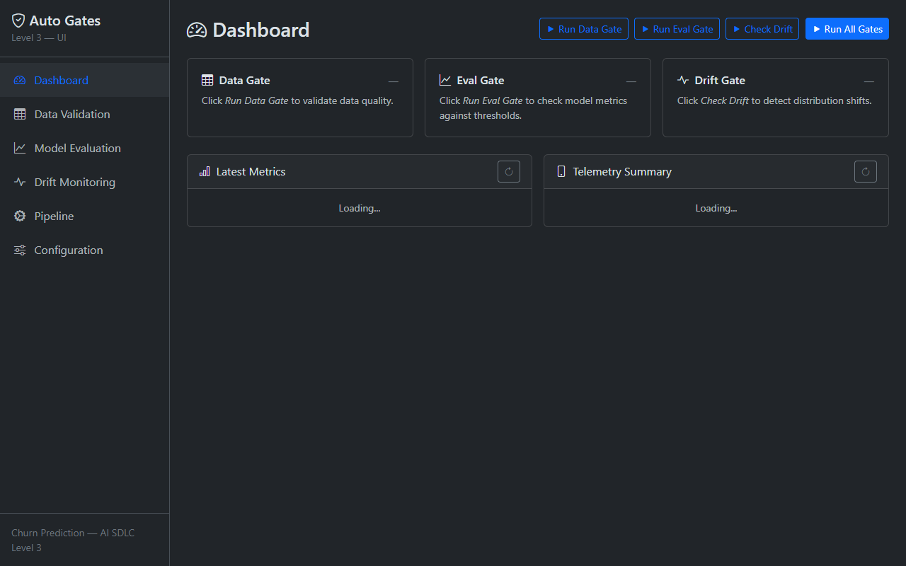
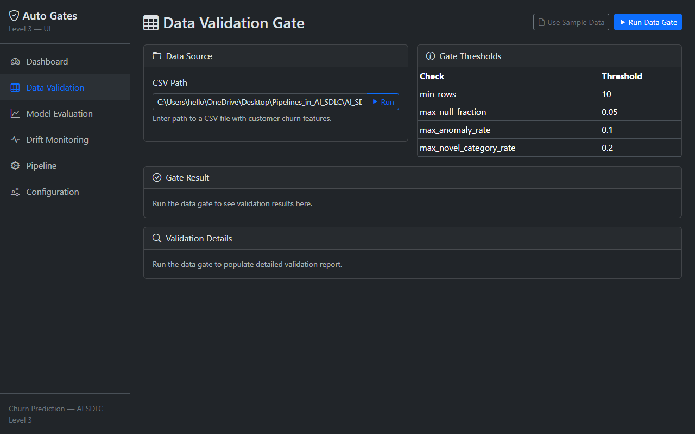
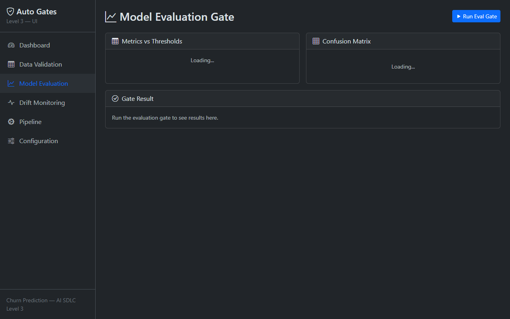
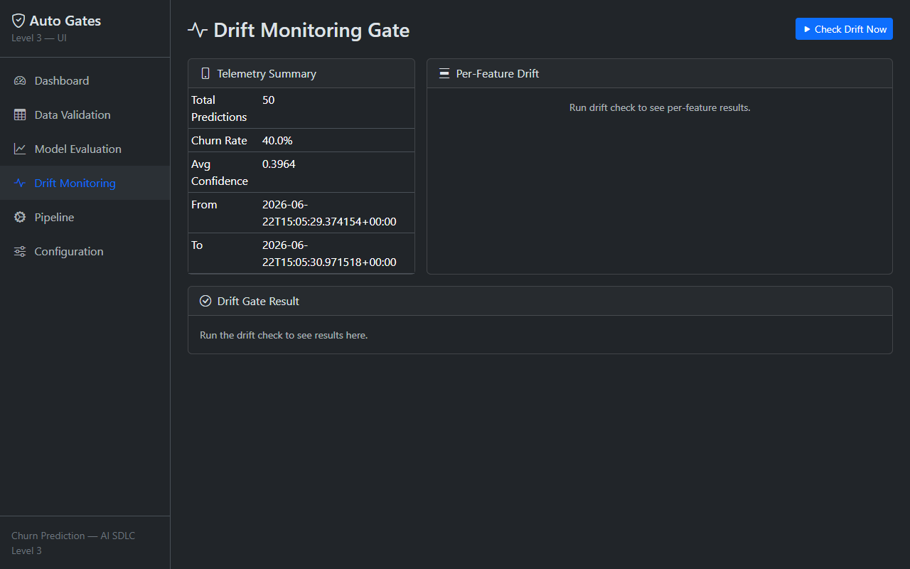
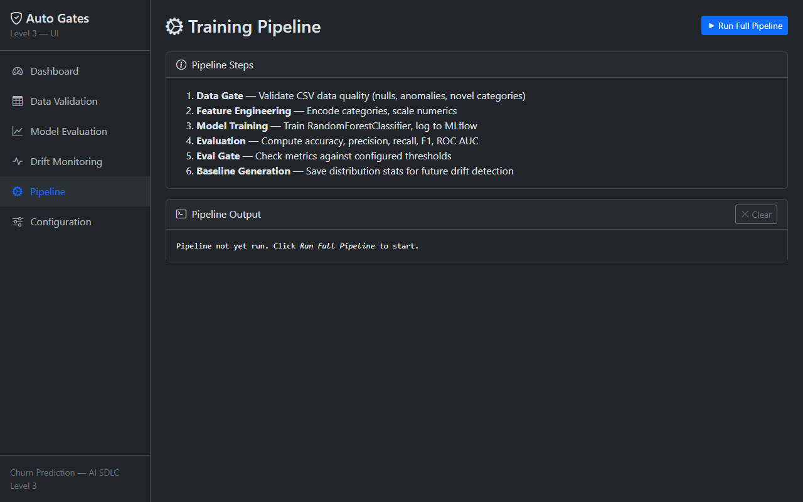
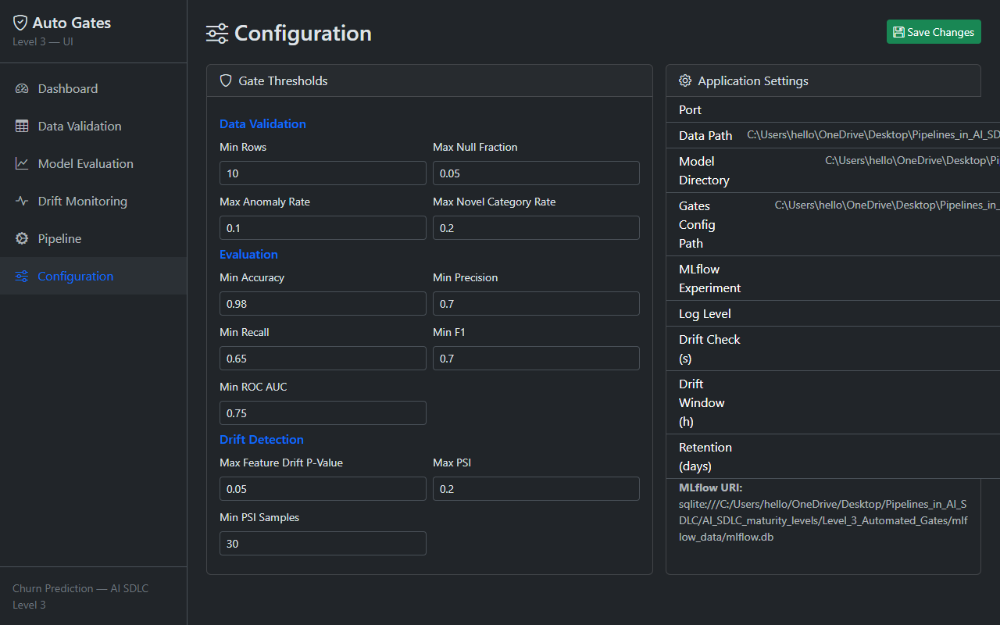

# Level 3 — Automated Gates

AI SDLC maturity level with automated quality gates, monitoring, and drift detection. Built on the customer churn prediction model from Levels 1–2.

---

## Dashboard — Control Center



| | |
|---|---|
| **Run All Gates** — one-click trigger for data, eval, and drift gates simultaneously | **Gate Cards** — each gate shows PASS/FAIL with per-check detail table |
| **Latest Metrics** — live accuracy, precision, recall, F1, ROC AUC from saved model | **Telemetry Summary** — total predictions, churn rate, confidence, time range |
| Auto-refreshes after every gate run | Status badges update in real-time |

---

## Data Validation Gate



| | |
|---|---|
| **CSV Path Input** — validate any CSV file, not just the sample data | **Gate Thresholds** — displays current config (min_rows, max_null, anomaly, novel cats) |
| **Gate Result** — pass/fail with per-check breakdown | **Validation Details** — full report: null fractions, anomaly rates, novel categories, warnings |
| Catches bad data before training starts | Saves compute costs by failing fast |

---

## Model Evaluation Gate



| | |
|---|---|
| **Metrics vs Thresholds** — every metric compared against its configured minimum | **Confusion Matrix** — TP / FP / FN / TN at a glance |
| **Per-Metric Status** — green PASS / red FAIL for each check | **Gate Result** — overall pass/fail with summary |

---

## Drift Monitoring Gate



| | |
|---|---|
| **Telemetry Summary** — live prediction statistics from SQLite | **Per-Feature Drift Table** — p-values, KS stats, live vs baseline means |
| **Overall PSI** — Population Stability Index across all features | **Drift Gate Result** — pass/fail with detected drifted features listed |
| Background thread checks drift every hour automatically | On-demand "Check Drift Now" button for immediate evaluation |

---

## Pipeline — Training End-to-End



| | |
|---|---|
| **Full Pipeline** — data gate → features → train → eval gate → baseline generation | **Live Terminal Output** — step-by-step logging as the pipeline executes |
| Stops on gate failure — no wasted compute | Model artifacts saved on success |

---

## Configuration Editor



| | |
|---|---|
| **Editable Thresholds** — data validation, evaluation, and drift thresholds in forms | **Save Changes** — writes directly to `config/gates.yaml`, no code deploy needed |
| **Application Settings** — read-only view of data paths, ports, intervals | Changes take effect immediately on next gate run |

---

## Quick Start

```bash
uv sync
uv run python scripts/train.py          # Train with gates
uv run python scripts/serve.py           # Start API server + web UI
uv run python scripts/check_drift.py     # Check prediction drift
uv run pytest tests/ -v                  # Run tests
```

## What's New vs Level 2

- Automated quality gates (data validation, evaluation thresholds, drift detection)
- Web UI dashboard with real-time results for all three gates
- Monitoring with SQLite telemetry and periodic drift checks (KS test + PSI)
- Alert system (file-based, extensible to email/Slack)
- Configurable thresholds — editable from UI or `config/gates.yaml`
- Background drift checker in the serving app
- API endpoints: `/api/gates/*`, `/api/config/*`, `/api/pipeline/*`, `/monitoring/*`
- CI workflow with `lint-test` → `eval-gate` → `build` jobs

## Directory Layout

```
Level_3_Automated_Gates/
├── app/                # Flask server + HTML templates
├── config/             # Gate thresholds (gates.yaml)
├── data/               # Training dataset
├── monitoring/         # Telemetry DB, baseline stats, alerts
├── screenshots/        # Application screenshots
├── scripts/            # train, evaluate, serve, validate, gates, drift
├── src/                # Reusable package (data, features, models, gates, monitoring)
├── tests/              # Pytest suite
├── .github/workflows/  # CI with gate checks
├── ARCHITECTURE.md     # Architecture document
├── BUSINESS_CASE.md    # Business case
├── DEMO_SCRIPT.md      # Executive demo walkthrough
└── Dockerfile
```
