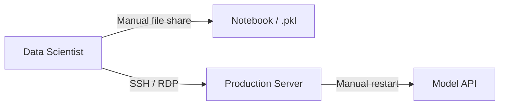
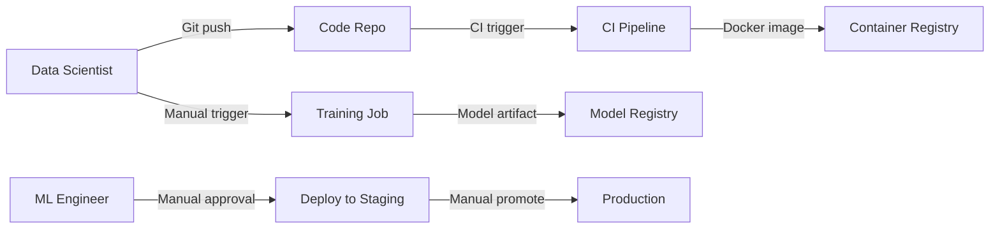
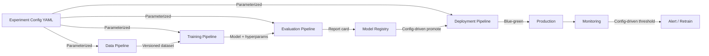
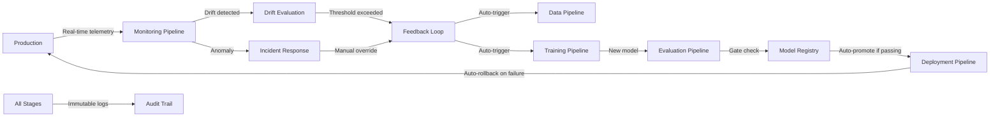

```mermaid
graph LR
    Raw[Raw Data] -->|Ingestion| DataPipe[Data Pipeline]
    DataPipe -->|Schema validation| FS[Feature Store]
    FS -->|Auto-trigger| Train[Training Pipeline]
    Train -->|Model artifact| Eval[Evaluation Pipeline]
    Eval -->|Pass/Fail gate| ModelReg[Model Registry]
    ModelReg -->|Promote if passed| CD[Deployment Pipeline]
    CD -->|Canary| Prod[Production]
    Prod -->|Telemetry| Monitor[Monitoring Pipeline]
    Monitor -->|Drift alert| Retrain[Auto-retrain trigger]
    Retrain -->|Trigger| DataPipe
```

# AI SDLC Maturity Levels

This folder describes the five levels of AI SDLC maturity as outlined in the main README. Each level represents a stage in an organization's evolution from ad-hoc, manual AI delivery to fully automated, closed-loop MLOps.

---

## Level 1 — Manual

**Description:** Notebooks are shared manually, models are deployed by hand, and there is no reproducibility or audit trail. Every delivery is a bespoke effort.

### Roles & Tasks

| Role | Tasks |
|------|-------|
| **Data Scientist** | Writes notebooks in isolation, manually exports `.pkl`/`.h5` files, copies code via email/shared drive, deploys models by running scripts on production servers |
| **IT / Ops** | Provisioned infrastructure on request, no visibility into model lifecycle |

### Handoff Diagram

### Shortcomings

- No version control for data, code, or models — full reproducibility is impossible
- Deployment is a high-risk manual process with no rollback strategy
- No monitoring — model degradation is only discovered via user complaints
- Context is siloed in individual notebooks; team bus-factor is extreme
- Evaluation is anecdotal (cherry-picked examples); no objective quality gates
- Every deployment is a unique snowflake — no standardized process

---

## Level 2 — Basic CI/CD

**Description:** Basic CI/CD is introduced for model code, but data pipelines and evaluation remain manual. Model artifacts are stored in a registry but deployment still requires manual approval.

### Roles & Tasks

| Role | Tasks |
|------|-------|
| **Data Scientist** | Commits model code to Git, manually runs data preprocessing scripts, trains locally or on ad-hoc compute |
| **ML Engineer** | Sets up CI pipeline (lint, type-check, unit tests), packages model into Docker image, manages model registry |
| **DevOps** | Manages deployment infrastructure, sets up staging/production environments |

### Handoff Diagram

### Shortcomings

- Data preprocessing is still manual and untracked — schema drift reaches production silently
- Evaluation is not automated; models are promoted based on a single screenshot of metrics
- CI pipeline only covers code, not data quality or model performance
- Manual approval is a bottleneck and still relies on human judgment for quality gates
- No monitoring pipeline — data drift and concept drift go undetected
- Rollback is a manual process involving reverting a Git tag and redeploying

---

## Level 3 — Automated Gates

**Description:** Data validation, model evaluation, and monitoring are automated pipeline stages. Quality gates prevent regressions from reaching production.

### Roles & Tasks

| Role | Tasks |
|------|-------|
| **Data Scientist** | Focuses on feature engineering and experimentation; pipeline triggers training automatically |
| **ML Engineer** | Maintains evaluation harness, configures quality gates, manages automated retraining triggers |
| **Data Engineer** | Owns data ingestion, schema validation, and feature store pipelines |
| **DevOps / MLOps** | Manages end-to-end pipeline orchestration, monitoring dashboards, and alerting |
| **SRE** | Responds to monitoring alerts from drift detection and performance degradation |

### Handoff Diagram

### Shortcomings

- Pipelines are still hardcoded — swapping a model architecture or dataset requires pipeline code changes
- Monitoring detects drift but cannot automatically correct it without human investigation
- Evaluation metrics are static; they do not adapt to changing business conditions
- Pipeline failures can cascade — a data pipeline failure blocks training, which blocks deployment
- Organization still relies on manual intervention for edge cases the pipeline cannot handle
- Cost governance is manual — no automated cost-aware routing or quota management

---

## Level 4 — Parameterized Pipelines

**Description:** The pipeline itself is parameterized and configurable — model architectures, hyperparameters, evaluation datasets, and deployment targets are swapped without rewriting orchestration logic.

### Roles & Tasks

| Role | Tasks |
|------|-------|
| **Data Scientist** | Defines experiment configs (YAML/JSON); runs parameterized sweeps without touching pipeline code |
| **ML Engineer** | Maintains pipeline framework, adds new pipeline stage types, manages reusable components |
| **Data Engineer** | Configures data sources and transformations via pipeline parameters |
| **MLOps / Platform Engineer** | Builds and maintains the pipeline platform, manages multi-project/multi-team reuse |
| **Product Manager** | Defines evaluation criteria and business KPIs that map to pipeline quality gates |

### Handoff Diagram

### Shortcomings

- Pipeline configuration can become complex and brittle — YAML drift is a real maintenance burden
- Requires a platform team to build and maintain the parameterization framework
- Multi-project reuse can lead to shared pipeline fragility — one team's change breaks another's config
- Evaluation criteria are still largely offline; online evaluation (A/B testing) is not fully integrated
- Parameterized pipelines are powerful but require strong governance to prevent configuration sprawl
- Not all stages are equally parameterizable — GPU provisioning and cost optimizations remain challenging

---

## Level 5 — Closed-Loop

**Description:** The pipeline includes automated retriggering based on production drift detection, closing the loop between deployment and continuous improvement. The system self-corrects within defined guardrails.

### Roles & Tasks

| Role | Tasks |
|------|-------|
| **Data Scientist** | Reviews automated retraining proposals, focuses on novel research and edge-case analysis |
| **ML Engineer** | Designs drift detection algorithms, maintains automated rollback logic, tunes feedback loops |
| **Data Engineer** | Maintains real-time data quality monitoring, manages data provenance for auditability |
| **MLOps / Platform Engineer** | Owns the closed-loop infrastructure, manages incident response automation |
| **SRE** | Monitors the monitor — ensures the monitoring pipeline itself is reliable |
| **Compliance / Audit** | Uses the immutable pipeline audit trail for regulatory reporting |
| **Product Manager** | Defines business-level KPIs that automatically trigger re-evaluation of pipeline thresholds |

### Handoff Diagram

### Shortcomings

- Closed-loop systems can enter oscillation — rapidly retraining and redeploying without meaningful improvement
- Requires exceptionally high test coverage and evaluation fidelity; a flawed eval gate corrupts the entire loop
- Debugging automated decisions is difficult — root cause analysis spans multiple autonomous cycles
- High infrastructure cost — maintaining always-on monitoring, retraining, and deployment pipelines is expensive
- Team must resist the temptation to fully automate everything; human judgment remains essential for novel scenarios
- Regulatory environments may require human-in-the-loop approval even when the pipeline is technically capable of full automation
- The monitoring pipeline itself is a single point of failure — if it goes down, the entire closed-loop breaks
